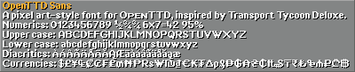
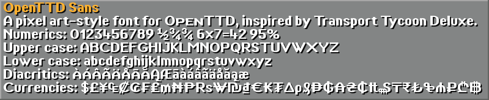

# OpenTTD TrueType typefaces
TrueType typefaces for text in a pixel art style, designed for use in OpenTTD. Drawn to broadly capture the look and feel of the pixel fonts in Transport Tycoon Deluxe.

These typefaces have a pixel-perfect appearance when rendered a specific height (or multiples thereof).

## Faces
### OpenTTD Sans
Heavy sans serif designed for use for dense medium-sized text.
Designed for use at 11 pixel height.

Full coverage of: `Basic Latin`, `Latin-1 Supplement`, `Latin Extended-A` and `Currency Symbols`.

### OpenTTD Serif
Light serif designed for use in sparse large text.
Designed for use at 19 pixel height.

_TODO_

### OpenTTD Small
Specialised very small size font for use in small text.
Designed for use at 6 pixel height.

_TODO_

## Building
Run `build.sh` to build the output TTF files. Requires `FontForge` and `Python`. `Python` requires `PIL`.
Developed and tested using `WSL`.

The master source files are the Fontforge SFD file. SVG files of individual glyphs are provided for convenience and not automatically imported.