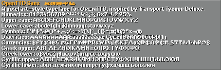
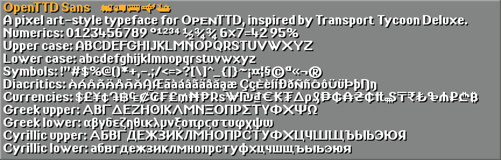
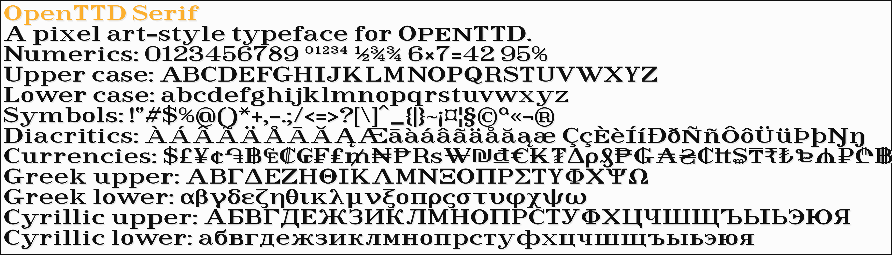
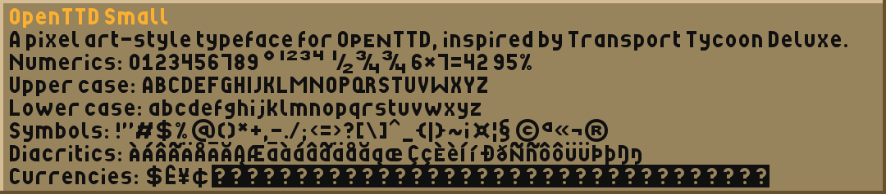

# OpenTTD TrueType typefaces
TrueType typefaces for text in a pixel art style, designed for use in OpenTTD. Drawn to broadly capture the look and feel of the pixel fonts in Transport Tycoon Deluxe.

These typefaces have a pixel-perfect appearance when rendered a specific height (or multiples thereof).

## Faces
### OpenTTD Sans
Heavy sans serif designed for use for dense medium-sized text.
Designed for use at 10 pixel height.

[OpenTTD-Sans.ttf](openttd-sans/OpenTTD-Sans.ttf)





Full coverage of: `Basic Latin`, `Latin-1 Supplement`, `Latin Extended-A` and `Currency Symbols`.

### OpenTTD Serif
Light serif designed for use in sparse large text.
Designed for use at 18 pixel height.

[OpenTTD-Serif.ttf](openttd-serif/OpenTTD-Serif.ttf)




Full coverage of: `Basic Latin`, `Latin-1 Supplement`, `Latin Extended-A` and `Currency Symbols`.

### OpenTTD Small
Specialised very small size typeface for use in small text.
Designed for use at 6 pixel height.

[OpenTTD-Small.ttf](openttd-small/OpenTTD-Small.ttf)




Full coverage of: `Basic Latin`, `Latin-1 Supplement`, `Latin Extended-A`.
_TODO: `Currency Symbols`_

## Using in OpenTTD
1. Download the typeface (font) TTF files. For each link, download the TTF file by clicking on "View raw": [OpenTTD-Sans.ttf](openttd-sans/OpenTTD-Sans.ttf), [OpenTTD-Serif.ttf](openttd-serif/OpenTTD-Serif.ttf) and [OpenTTD-Small.ttf](openttd-small/OpenTTD-Small.ttf).
2. Install as normal for your operating system. In Windows, double-click on the TTF file to open it, then click "Install" in the top left.
3. Set up OpenTTD to use the fonts. In your [openttd.cfg](https://wiki.openttd.org/en/Archive/Manual/Settings/Openttd.cfg) file, change the font settings to the following:

```
small_font = OpenTTD Small
medium_font = OpenTTD Sans
large_font = OpenTTD Serif
small_size = 6
medium_size = 10
large_size = 18
small_aa = true
medium_aa = true
large_aa = true
```

If you want a more pixel-art apperance then set `small_aa`, `medium_aa` and `large_aa` to `false`.

If you want the text in-game to appear larger, it is best to use the "Interface size" setting in "Game Options > Graphics". You can also change the font size in your `openttd.cfg` - for best results stick to multiples of `6`, `10` and `18` respectively.

To uninstall, just remove the font names from the `small_font`, `medium_font` and `large_font` entries in `openttd.cfg`:
```
small_font = 
medium_font = 
large_font = 
```

## Mistakes and Bugs
There might be mistakes or bugs, if you spot any problems please let me know! I'm a native English speaker, so the non-standard Latin alphabet and diacritics are where you are most likely to find errors. The best way to report problems is is using Github Issues.

## Building
Run `build.sh` to build the output TTF files. Requires `FontForge` and `Python`. `Python` requires `PIL`.
Developed and tested using `WSL`.

The master source files are the Fontforge SFD file. SVG files of individual glyphs are provided for convenience and not automatically imported.
