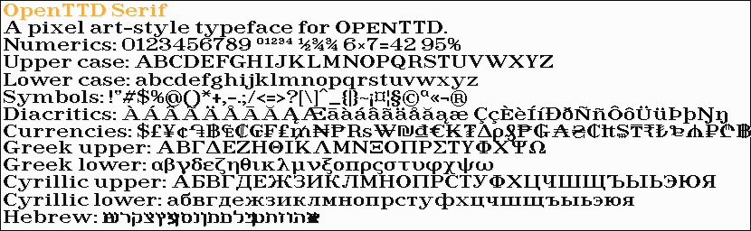

# OpenTTD TrueType typefaces
TrueType typefaces for text in a pixel art style, designed for use in OpenTTD. Drawn to broadly capture the look and feel of the pixel fonts in Transport Tycoon Deluxe.

These typefaces have a pixel-perfect appearance when rendered a specific height (or multiples thereof).

## Faces
### OpenTTD Sans
Heavy sans serif designed for use for dense medium-sized text.
Designed for use at 10 pixel height.

[OpenTTD-Sans.ttf](openttd-sans/OpenTTD-Sans.ttf)

Full coverage of: `Basic Latin`, `Latin-1 Supplement`, `Latin Extended-A` and `Currency Symbols`.

### OpenTTD Serif
Light serif designed for use in sparse large text.
Designed for use at 18 pixel height.

[OpenTTD-Serif.ttf](openttd-serif/OpenTTD-Serif.ttf)

Full coverage of: `Basic Latin`, `Latin-1 Supplement`, `Latin Extended-A`.
_TODO: `Currency Symbols`_

_TODO_

### OpenTTD Small
Specialised very small size typeface for use in small text.
Designed for use at 6 pixel height.

[OpenTTD-Small.ttf](openttd-small/OpenTTD-Small.ttf)

Full coverage of: `Basic Latin`, `Latin-1 Supplement`, `Latin Extended-A`.
_TODO: `Currency Symbols`_

## Building
Run `build.sh` to build the output TTF files. Requires `FontForge` and `Python`. `Python` requires `PIL`.
Developed and tested using `WSL`.

The master source files are the Fontforge SFD file. SVG files of individual glyphs are provided for convenience and not automatically imported.